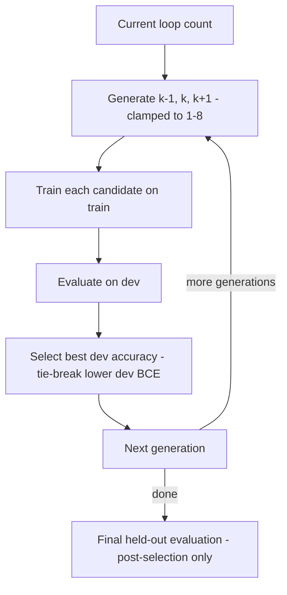

<p align="center">
  <h1 align="center">RLT-RSI Experiment</h1>
  <p align="center">
    Looped transformers × RSI-style iterative adaptation — a reproducible parity
    study of recurrent depth, length generalization, and bounded loop-schedule search.
  </p>
</p>

<p align="center">
  <a href="https://github.com/rustfuture/rlt-rsi-experiment/actions/workflows/ci.yml"></a>
  
  <a href="LICENSE"></a>
  <a href="https://colab.research.google.com/github/rustfuture/rlt-rsi-experiment/blob/main/notebooks/rlt_rsi_colab.ipynb"></a>
</p>

<p align="center">
  <a href="#at-a-glance">At a Glance</a> ·
  <a href="#two-paths">Paths</a> ·
  <a href="#quick-start">Quick Start</a> ·
  <a href="#reading-the-results-honestly">Results</a> ·
  <a href="#scientific-integrity-notes">Integrity</a> ·
  <a href="#rsi-style-iterative-adaptation">RSI Mode</a>
</p>

A minimal, reproducible experiment comparing a conventional transformer with a
shared-weight recurrent/looped transformer on binary sequence parity. The experiment
probes iterative computation, compute scaling, and length generalization; it does not
test or claim general reasoning ability.

On top of that baseline, a separate mode performs **RSI-style iterative adaptation**
over the recurrent loop schedule — bounded candidate loop counts, dev-set selection, and
a final post-selection held-out evaluation. It is not unrestricted or general Recursive
Self-Improvement and makes no claim of intelligence improvement.

## At a Glance

| | |
|---|---|
| Task | Binary sequence parity; train/dev lengths 4–8, held-out lengths 12–16 |
| Models | Conventional transformer vs. shared-weight looped transformer |
| Backends | NumPy (frozen features) and PyTorch (end-to-end) |
| RSI mode | Bounded loop-schedule search, dev selection, post-selection held-out |
| Splits | Example-disjoint by construction; zero-overlap asserted per seed |
| Tests | Full suite in CI (a NumPy job and a Torch-CPU job) |

## Two Paths

**RLT baseline** (`rlt_rsi.train`)

- conventional single-pass `baseline` reference
- shared-weight `looped` model at loop counts 1, 2, 4
- loop-count scaling vs. measured wall-clock compute
- length generalization to held-out lengths 12–16

**RSI-style iterative adaptation** (`rlt_rsi.train_rsi`)

- bounded candidate loop counts
- per-candidate training on the train split
- dev-set evaluation and selection
- explicit lineage per generation
- final held-out evaluation, post-selection only

## How the RSI Loop Works



## Quick Start

```bash
# Setup
python3 -m venv .venv
. .venv/bin/activate
python -m pip install -e '.[dev]'

# Optional: real training backend (not required for the NumPy smoke path)
python -m pip install -e '.[torch]'

# NumPy smoke pipeline (frozen features; plumbing check only)
python -m rlt_rsi.train --backend numpy --seeds 7,42,123 --output results/smoke.json

# Torch pipeline (device auto -> cuda, else mps, else cpu)
python -m rlt_rsi.train --backend torch --device auto --seeds 7,42,123 --epochs 80 \
    --artifacts-dir results/torch-<device>-<date>

# Test suite
pytest -q
```

Prefer no local setup? Open [`notebooks/rlt_rsi_colab.ipynb`](notebooks/rlt_rsi_colab.ipynb)
in Colab. Stage A is a CPU-safe NumPy smoke and RSI run; Stage B runs the Torch path only
when a GPU is available.

The runner evaluates 4 configurations across 3 seeds (`7, 42, 123`):

- `baseline` (loops=1): single-pass reference
- `looped` (loops=1): shared-weight model, single pass
- `looped` (loops=2): 2 sequential block applications per step
- `looped` (loops=4): 4 sequential block applications per step

## What Each Backend Actually Does

| | NumPy (`--backend numpy`) | PyTorch (`--backend torch`) |
|---|---|---|
| Attention | manual scaled dot-product | `nn.MultiheadAttention` |
| Normalization | RMS-style | `nn.LayerNorm` |
| Training scope | **frozen** embedding + block; **only** the linear readout + bias are trained | **all** parameters, end-to-end |
| Parameters | total 4,681 = frozen 4,656 + trainable 25 | total 4,945, all trainable |
| dtype / device | float64 / CPU | float32 / resolved torch device |
| Purpose | smoke + plumbing check; **not** evidence about trained recurrence | intended research run |

The two architectures are **not** parameter-identical, so their parameter counts are not
comparable across backends. `architecture_parameters()` is retained for backward
compatibility and returns the *frozen backbone subtotal only* (embedding + block); it is
never the total. Use `total_parameters()` / `trainable_parameters()` / `frozen_parameters()`.

## Device Selection (Torch)

`--device auto|cpu|mps|cuda` (default `auto`):

- `cpu` → CPU
- `cuda` → requires `torch.cuda.is_available()`, otherwise raises `RuntimeError`
- `mps` → requires `torch.backends.mps.is_available()`, otherwise raises `RuntimeError`
- `auto` → cuda if available, else mps if available, else cpu

There is **no silent fallback**; the requested and resolved devices are recorded in the
payload and report.

## Reading the Results Honestly

- **`estimated_block_calls`** counts sequential applications of the shared transformer
  block. It is a structural counter — **not** a FLOP count and **not** a latency
  measurement. Measured wall-clock training time is reported separately as `seconds`.
- **Equal epoch counts are not equal compute budgets.** A `loop_count=k` configuration
  performs `k` block applications per optimisation step, so higher loop counts do more
  work per step. Compare the measured `seconds` column (hardware-specific).
- **The ±5 percentage-point rule is an operational decision rule only.** It is not a
  statistical significance test, confidence interval, or equivalence test. Results are
  scoped to this run, task, seeds, and sample sizes.
- **Paired per-seed deltas** (`paired_delta_vs_baseline`, with mean/std/stderr) are
  reported per configuration alongside aggregate means.
- **H1, H2 and H0 are operational rules.** H2 uses
  `drop = dev_accuracy(lengths 4–8) - heldout_accuracy(lengths 12–16)`, excluding training
  examples. A smaller gap can reflect worse dev performance, so it is exploratory and must
  be read alongside absolute accuracies. The corrected reference is
  `results/torch-cpu-dev-reference/`.
- **Splits are example-disjoint by construction.** Train/dev are drawn as one joint pool
  of unique examples and randomly partitioned; held-out uses disjoint lengths and excludes
  train/dev examples. The overlap count per seed is recorded and asserted to be zero;
  `make_splits` raises rather than returning overlapping examples.
- Because unique examples are required, the empirical length distribution deviates from
  uniform (the short-length example spaces are tiny); per-split `length_counts` are
  recorded in the split manifest.

## RSI-Style Iterative Adaptation

`rlt_rsi.train_rsi` adds a bounded iterative adaptation mode over the same parity task.
The search only mutates the recurrent loop schedule, selection uses the `dev` split, and
the held-out split is read only once at the end as a post-selection evaluation.

```text
current loop count
→ bounded candidate loop counts (current, current + 1, current - 1, clamped to 1-8)
→ train each candidate on the train split for --rsi-epochs-per-gen
→ evaluate each candidate on the dev split
→ select the candidate with the best dev accuracy (ties broken by lower dev BCE)
→ carry the selected loop count into the next generation
→ final held-out evaluation of the selected lineage (post-selection only)
```

The held-out split is never used during candidate generation, scoring, or selection. Each
`lineage` entry records the candidate proposals, the accepted loop count, the post-training
train BCE, and dev accuracy/BCE; the run reports a finite `final_train_bce`.

```bash
# NumPy backend (frozen features; plumbing check, no torch required)
python -m rlt_rsi.train_rsi --backend numpy --seeds 7,42,123 \
    --rsi-generations 5 --rsi-epochs-per-gen 8 --output results/rsi_smoke.json

# Torch backend (end-to-end training; device auto -> cuda, else mps, else cpu)
python -m rlt_rsi.train_rsi --backend torch --device auto --seeds 7,42,123 \
    --rsi-generations 5 --rsi-epochs-per-gen 8 --output results/rsi_torch.json
```

## Artifacts

| Path | Contents |
|---|---|
| `results/smoke.json`, `results/smoke.md` | NumPy smoke output (frozen features; plumbing check only) |
| `results/archive-v1/` | Superseded v1 smoke output, retained as evidence |
| `results/torch-smoke/` | Tiny CPU torch smoke run (`--epochs 2`) |
| `results/torch-cpu-dev-reference/` | Corrected CPU torch reference (JSON + manifest + report) |
| `results/torch-mps-2026-09-15/` | Recorded MPS run discussed in the integrity notes |

Checkpoint `.pt` files are small but **not portable** (machine/torch-build specific) and
are gitignored under `results/*/checkpoints/`; only the JSON manifest with SHA-256 hashes
is tracked. Regenerate them with the rerun command recorded in the manifest.

## Scientific Integrity Notes

- **Measured MPS run-to-run instability (this round).** Re-running the recorded command
  (`--backend torch --device auto --seeds 7,42,123 --epochs 80`) reproduced the baseline
  and looped-2 results but changed looped-4: held-out accuracy 0.5052 → 0.5208 and paired
  delta +0.0417 → +0.0573, flipping the operational label from `flat` to `improvement`. MPS
  kernels are not bit-exact, so the ±0.05 label near the threshold is not stable across
  identical re-runs. This is reported as a limitation, not hidden.
- The hypotheses and decision rule are **specified in advance of the run** but are **not** a
  preregistered protocol: `DESIGN.md` and the first results were committed in the same
  commit (`161752a`), so commit history does not establish precedence.
- NumPy frozen-feature smoke results **do not measure whether trained recurrence helps**;
  they verify plumbing, determinism, and aggregation only.
- Torch runs train end-to-end, but with 3 seeds and small sample sizes the ±0.05 rule cannot
  establish significance or equivalence. Any "improvement" label is an operational-rule
  outcome for this run only.
- CI runs `pytest -q` plus a NumPy smoke in a Python 3.11 job without torch, and the
  Torch-CPU job installs CPU torch and runs the full suite including the Torch RSI
  regression test.

<details>
<summary>Design references (scoped theory context)</summary>

- Khattab et al. (2024). *DSPy: Compiling Declarative Language Model Calls into
  Self-Improving Pipelines.* ICLR 2024. [arXiv:2310.03714](https://arxiv.org/abs/2310.03714).
- Chiang, Cholak & Pillay (2023). *Tighter Bounds on the Expressivity of Transformer
  Encoders.* ICML 2023, PMLR 202:5544–5562.
  [link](https://proceedings.mlr.press/v202/chiang23a.html). Fixed-precision transformer
  encoders recognize only languages in uniform TC⁰; parity is in TC⁰, so no claim is made
  that transformers can *never* represent parity.
- Anil et al. (2022). *Exploring Length Generalization in Large Language Models.* NeurIPS
  2022. [link](https://mlanthology.org/neurips/2022/anil2022neurips-exploring/).
- Dehghani et al. (2019). *Universal Transformers.* ICLR 2019.
  [arXiv:1807.03819](https://arxiv.org/abs/1807.03819).
- Giannou et al. (2023). *Looped Transformers as Programmable Computers.* ICML 2023.
  [link](https://collaborate.princeton.edu/en/publications/looped-transformers-as-programmable-computers/).

</details>

## Repository Map

| Path | Contents |
|---|---|
| `rlt_rsi/train.py` | Baseline and looped training, backends, evaluation |
| `rlt_rsi/train_rsi.py` | RSI-style iterative adaptation CLI and reporting |
| `rlt_rsi/rsi.py` | RSI loop (`run_rsi_numpy`, `run_rsi_torch`) |
| `rlt_rsi/data.py` | Example-disjoint split generation and manifests |
| `rlt_rsi/model.py` | NumPy model and configuration |
| `tests/` | Data, model, generalization, RSI, and torch tests |
| `results/` | Committed experiment artifacts |
| `notebooks/rlt_rsi_colab.ipynb` | CPU smoke + optional GPU walkthrough |

## License

MIT — see [LICENSE](LICENSE).
